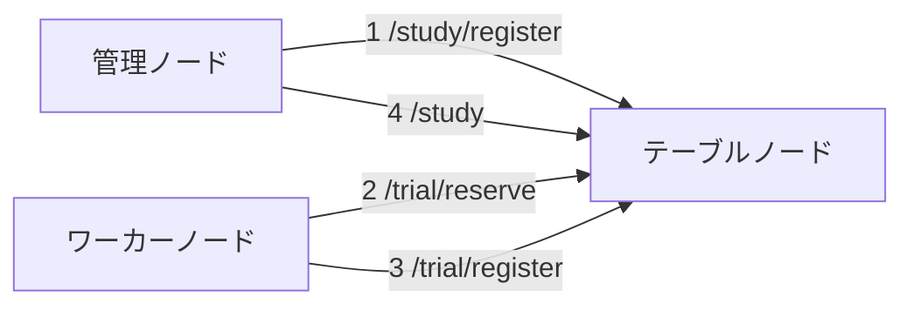

# lite_dist
簡易的な分散処理システムです

## 1. 必要要件
python >= 3.12

## 2. 依存ライブラリ
- flask
- requests
- tqdm
- pytest

## 3. 機能の概要
与えられた `Study` (タスクのこと) を分散処理で実行します。次の3種類のノードを使用します。実際の物理マシンはどれを兼任しても問題無いです。
> [!WARNING]  
> 現状の実装ではハッシュ関数の原像計算のみに対応しています。

### 3-1. 管理ノード
`Study` の登録や結果の取得を行います。このノードを動かすための python スクリプトは現状では実装していないので、curl や talend などのAPIツールを使用してください。

### 3-2. テーブルノード
`Study` を細切れにした `Trial` を管理するノードです。`Trial` の提案とその結果の集約を行います。このノードの台数は常に1台にしてください。

### 3-3. ワーカーノード
テーブルノードから取得した `Trial` を実行し、結果をテーブルノードに返却します。

## 4. ノード構成

数字は典型的な使い方でのAPIアクセスの順番を表しています。

## 5. 使い方
以下のコマンドはリポジトリ直下で行います。
> [!CAUTION]  
> グローバルIPが必要な環境では使用できません。必ずLAN内で使用してください。  
> また、テーブルノードはIPをLAN内に開放しているので、必ず信頼できるネットワーク内でのみ利用してください。

### 5-1. 事前準備
テーブルノード、ワーカーノードとして使うマシンにリポジトリをクローンし、依存ライブラリをインストールしてください。  
管理ノードに対してはこの操作は不要です。

### 5-2.  テーブルノードの起動
テーブルノードで以下のコマンドを実行してください。
```shell
python start_table_node.py
```
起動が成功すれば、プライベートIPアドレスが表示されるので、以降はこの値を使ってください。

### 5-3. Study の登録
管理ノードから以下のような JSON を POST してください。
```shell
curl -X POST \
     -H "Content-Type: application/json" \
     -d '{"target":"caf9b6b99962bf5c2264824231d7a40c", "method":"md5"}' \
     http://{IP_OF_TABLE_NODE}:80/study/register
```
`{IP_OF_TABLE_NODE}` にはテーブルノードのIPアドレスを入れてください。またポート番号は config で変更できます。
成功すれば以下のような JSON が返却されるはずです。
```json
{
  "study_id": "a5ae10cf-c9cf-11ef-ac70-caf9b6b99962",
  "message": null,
  "success": true
}
```
`study_id` は最後に結果を取得するときに使用します。

### 5-4. ワーカーノードの起動
ワーカーノードで以下のコマンドを実行してください。
```shell
python start_worker_node.py {IP_OF_TABLE_NODE} worker_node_1
```
同様に `{IP_OF_TABLE_NODE}` にはテーブルノードのIPアドレスを入れてください。  
`worker_node_1` はこのノードの名前です。好きな値を入れてください。テーブルノードのログ表示に使われます。  
以降はワーカーノードがテーブルノードから `Trial` を取得し、計算し、結果を POST する一連の作業が自動で行われます。

### 5-5. 結果の取得
以下のコマンドで結果を取得できます。
```shell
curl http://{IP_OF_TABLE_NODE}:80/study?study_id=a5ae10cf-c9cf-11ef-ac70-caf9b6b99962
```
計算が終わっていれば次のような JSON が返却されます。
```json
{
    "current_max": 1778384895,
    "method": "md5",
    "result": "696e666f",
    "study_id": "4dd9e078-ca16-11ef-8f79-caf9b6b99962",
    "target": "caf9b6b99962bf5c2264824231d7a40c",
    "trial_table": [
        {
            "method": "md5",
            "preimage": null,
            "range": {
                "size": 1761607680,
                "start": "0"
            },
            "status": "DONE",
            "study_id": "4dd9e078-ca16-11ef-8f79-caf9b6b99962",
            "target": "caf9b6b99962bf5c2264824231d7a40c",
            "trial_id": "xa569f81a8b641ae"
        },
        {
            "method": "md5",
            "preimage": "696e666f",
            "range": {
                "size": 16777216,
                "start": "69000000"
            },
            "status": "RESOLVED",
            "study_id": "4dd9e078-ca16-11ef-8f79-caf9b6b99962",
            "target": "caf9b6b99962bf5c2264824231d7a40c",
            "trial_id": "726b62698a2436db"
        }
    ]
}

```
各項目については後述しますが `result` が今回の計算結果です。
終わっていなければ以下のようなメッセージが返却されます。
```json
{
  "message": "a5ae10cf-c9cf-11ef-ac70-caf9b6b99962 has not been resolved yet"
}
```

## 6. テーブルノードのAPI仕様

| パス              | メソッド | パラメータ                           | ボディ     | レスポンス                  | 説明                                                                                                           |
|-----------------|------|---------------------------------|---------|------------------------|--------------------------------------------------------------------------------------------------------------|
| /study          | GET  | study_id: `str`                 | なし      | `Study` あるいは `Message` | 処理結果の取得を試みます。<br/>まだ処理が完了していない場合は `Message` が返却されます。                                                         |
| /study/register | POST | なし                              | `Study` | `StudyRegisterResult`  | テーブルノードに `Study` を登録する時に使います。。                                                                               |
| /trial/reserve  | GET  | max_size: `int`<br/>name: `str` | なし      | `Trial`                | ワーカーノードが担当する `Trial` を確保するときに使います。<br/>テーブルノードの状況によっては計算量 (`Trial.trial_range.size`) が max_size を下回ることがあります。 |
| /trial/register | POST | name: `str`                     | `Trial` | `TrialRegisterResult`  | ワーカーノードが担当した `Trial` を登録する時に使います。                                                                            |
| /status         | GET  | なし                              | なし      | `Curriculum`           | 現在のテーブルノードの状況を確認できます。                                                                                        |

## 7. Config
リポジトリには `config.json` が用意されていて、この値で分散処理のいくつかの振る舞いを制御できます。

| 名前                         | 型   | 必須    | 説明                                                                  |
|----------------------------|-----|-------|---------------------------------------------------------------------|
| common.minimum_chunk_size  | int | true  | `Trial` のサイズの最小値。実際のサイズはこの値と worker.trial_size_ratio との積。必ず2の累乗にする。 |
| table.port                 | int | true  | テーブルノードが利用するポート番号                                                   |
| table.trial_suggest_method | str | true  | `Trial` を提案する際に使用する手法。現状では `"sequential"` のみが有効。                    |
| worker.thread_num          | int | false | ワーカーノードで使用するスレッドの数。デフォルト値は 0 で、この場合はCPU数を使う。                        |
| worker.trial_size_ratio    | int | false | `Trial` のサイズを決める倍率。デフォルト値は 0 で、この場合は実行前にベンチマークを行い、それを元に決定する。        |
| worker.sleep_sec_on_empty  | int | false | テーブルノードの `Study` が無くなった際に待機する秒数。デフォルト値は 10 (秒)。                     |


## 8. 型定義
### 8-1. Trial
| 名前          | 型            | 必須    | 説明                                                                                                                                                        |
|-------------|--------------|-------|-----------------------------------------------------------------------------------------------------------------------------------------------------------|
| study_id    | str          | true  | 親となる `Study` の ID。target と生成時刻から生成される。                                                                                                                    |
| trial_id    | str          | true  | このオブジェクトの ID。study_id と trial_range から生成される。                                                                                                              |
| trial_range | `TrialRange` | true  | 計算する範囲。                                                                                                                                                   |
| target      | str          | true  | 目標となる値。バイト配列をhex表記したもの。                                                                                                                                   |
| method      | str          | true  | 計算手法を表す文字列。                                                                                                                                               |
| status      | str          | true  | この `Trial` の状態。取りうる値は以下の通り。<br/>- NOT_CALCULATED: 計算前<br/>- RESERVED: いずれかの `Trial` により確保されている<br/>- DONE: 計算済み<br/>- RESOLVED: 計算済み、かつ親の `Study` が完了している |
| preimage    | str          | false | target を生成する元の値。                                                                                                                                          |

### 8-2. TrialRange
| 名前    | 型   | 必須   | 説明                                                 |
|-------|-----|------|----------------------------------------------------|
| start | str | true | その `Trial` で行う計算範囲の起点。バイト配列をhex表記したもの。             |
| size  | int | true | その `Trial` で行う計算範囲のサイズ。ここはhex表記ではなく `int` であるので注意。 |

### 8-3. Study
| 名前          | 型             | 必須                      | 説明                                        |
|-------------|---------------|-------------------------|-------------------------------------------|
| study_id    | str           | false<br/>(/study では必須) | このオブジェクトのID。/study/register で登録した際に発行される。 |
| target      | str           | true                    | 目標となる値。バイト配列を hex 表記したもの。                 |
| method      | str           | true                    | 計算手法を表す文字列。                               |                                           |
| trial_table | list[`Trial`] | false<br/>(/study では必須) | 計算手法を表す文字列。                               |                                           |
| result      | str           | false                   | target を生成する元の値。                          |                                           |
| current_max | str           | false<br/>(/study では必須) | その時点で計算している値の最大値。 バイト配列を hex 表記したもの。      |                                           |


### 8-4. Curriculum
| 名前      | 型             | 必須   | 説明                 |
|---------|---------------|------|--------------------|
| studies | list[`Study`] | true | 実行予定の `Study` の一覧。 |

### 8-5. TrialRegisterResult
| 名前       | 型    | 必須    | 説明                          |
|----------|------|-------|-----------------------------|
| success  | bool | true  | 登録が成功したかどうかを表すフラグ。          |
| has_hext | bool | true  | 次の `Trial` が確保可能かどうかを表すフラグ。 |
| message  | str  | false | 登録が失敗した際のエラーメッセージ。          |

### 8-6. StudyRegisterResult
| 名前       | 型    | 必須    | 説明                 |
|----------|------|-------|--------------------|
| success  | bool | true  | 登録が成功したかどうかを表すフラグ。 |
| study_id | str  | true  | 登録時に発行されるID。       |
| message  | str  | false | 登録が失敗した際のエラーメッセージ。 |

### 8-7. Message
| 名前      | 型   | 必須   | 説明 |
|---------|-----|------|----|
| message | str | true |    |
