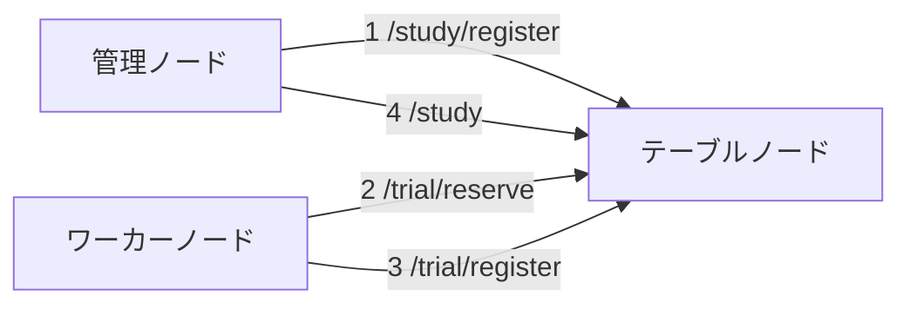

# lite_dist
簡易的な分散処理システムです

## 1. 必要要件
python >= 3.12

## 2. 依存ライブラリ
- flask
- requests
- tqdm
- pytest

## 3. 機能の概要
与えられた `Study` (タスクのこと) を分散処理で実行します。次の3種類のノードを使用します。実際の物理マシンはどれを兼任しても問題無いです。
> [!WARNING]  
> 現状の実装ではハッシュ関数の原像計算のみに対応しています。
> 
### 3-1. 管理ノード
`Study` の登録や結果の取得を行います。このノードを動かすための python スクリプトは現状では実装していないので、curl や talend などのAPIツールを使用してください。

### 3-2. テーブルノード
`Study` を細切れにした `Trial` を管理するノードです。`Trial` の提案とその結果の集約を行います。このノードの台数は常に1台にしてください。

### 3-3. ワーカーノード
テーブルノードから取得した `Trial` を実行し、結果をテーブルノードに返却します。

## 4. ノード構成

カッコ内の数字は典型的な使い方でのAPIアクセスの順番を表しています。

## 5. 使い方
以下のコマンドはリポジトリ直下で行います。
> [!CAUTION]  
> グローバルIPが必要な環境では使用できません。必ずLAN内で使用してください。  
> また、テーブルノードはIPをLAN内に開放しているので、必ず信頼できるネットワーク内でのみ利用してください。

### 5-1. 事前準備
テーブルノード、ワーカーノードとして使うマシンにリポジトリをクローンし、依存ライブラリをインストールしてください。  
管理ノードに対してはこの操作は不要です。

### 5-2.  テーブルノードの起動
テーブルノードで以下のコマンドを実行してください。
```shell
python start_table_node.py
```
起動が成功すれば、プライベートIPアドレスが表示されるので、以降はこの値を使ってください。

### 5-3. Study の登録
管理ノードから以下のような JSON を POST してください。
```shell
curl -X POST \
     -H "Content-Type: application/json" \
     -d '{"target":"caf9b6b99962bf5c2264824231d7a40c", "method":"md5"}' \
     http://{IP_OF_TABLE_NODE}:80/study/register
```
`{IP_OF_TABLE_NODE}` にはテーブルノードのIPアドレスを入れてください。またポート番号は config で変更できます。
成功すれば以下のような JSON が返却されるはずです。
```json
{
  "study_id": "a5ae10cf-c9cf-11ef-ac70-caf9b6b99962",
  "message": null,
  "success": true
}
```
`study_id` は最後に結果を取得するときに使用します。

### 5-4. ワーカーノードの起動
ワーカーノードで以下のコマンドを実行してください。
```shell
python start_worker_node.py {IP_OF_TABLE_NODE} worker_node_1
```
同様に `{IP_OF_TABLE_NODE}` にはテーブルノードのIPアドレスを入れてください。  
`worker_node_1` はこのノードの名前です。好きな値を入れてください。テーブルノードのログ表示に使われます。  
以降はワーカーノードがテーブルノードから `Trial` を取得し、計算し、結果を POST する一連の作業が自動で行われます。

### 5-5. 結果の取得
以下のコマンドで結果を取得できます。
```shell
curl http://{IP_OF_TABLE_NODE}:80/study?study_id=a5ae10cf-c9cf-11ef-ac70-caf9b6b99962
```
計算が終わっていれば次のような JSON が返却されます。
```json
{
    "current_max": 1778384895,
    "method": "md5",
    "result": "696e666f",
    "study_id": "4dd9e078-ca16-11ef-8f79-caf9b6b99962",
    "target": 269800643169556693053557693941273830412,
    "trial_table": [
        {
            "method": "md5",
            "preimage": null,
            "range": {
                "size": 1761607680,
                "start": "0"
            },
            "status": "DONE",
            "study_id": "4dd9e078-ca16-11ef-8f79-caf9b6b99962",
            "target": "caf9b6b99962bf5c2264824231d7a40c",
            "trial_id": "xa569f81a8b641ae"
        },
        {
            "method": "md5",
            "preimage": "696e666f",
            "range": {
                "size": 16777216,
                "start": "69000000"
            },
            "status": "RESOLVED",
            "study_id": "4dd9e078-ca16-11ef-8f79-caf9b6b99962",
            "target": "caf9b6b99962bf5c2264824231d7a40c",
            "trial_id": "726b62698a2436db"
        }
    ]
}

```
各項目については後述しますが `result` が今回の計算結果です。
終わっていなければ以下のようなメッセージが返却されます。
```json
{
  "message": "a5ae10cf-c9cf-11ef-ac70-caf9b6b99962 has not been resolved yet"
}
```

## 6. テーブルノードのAPI仕様

| パス              | メソッド | パラメータ                           | ボディ     | レスポンス                  | 説明                                                                                                           |
|-----------------|------|---------------------------------|---------|------------------------|--------------------------------------------------------------------------------------------------------------|
| /study          | GET  | study_id: `str`                 | なし      | `Study` あるいは `Message` | 処理結果の取得を試みます。<br/>まだ処理が完了していない場合は `Message` が返却されます。                                                         |
| /study/register | POST | なし                              | `Study` | `StudyRegisterResult`  |                                                                                                              |
| /trial/reserve  | GET  | max_size: `int`<br/>name: `str` | なし      | `Trial`                | ワーカーノードが担当する `Trial` を確保するときに使います。<br/>テーブルノードの状況によっては計算量 (`Trial.trial_range.size`) が max_size を下回ることがあります。 |
| /trial/register | POST | name: `str`                     | `Trial` | `TrialRegisterResult`  |                                                                                                              |
| /status         | GET  | なし                              | なし      | `Curriculum`           | 現在のテーブルノードの状況を確認できます。                                                                                        |

## 7. 型定義

### 7-1. Trial

### 7-2. Study

### 7-3. Curriculum

### 7-4. TrialRegisterResult

### 7-5. StudyRegisterResult

### 7-6. Message

## 8. Config