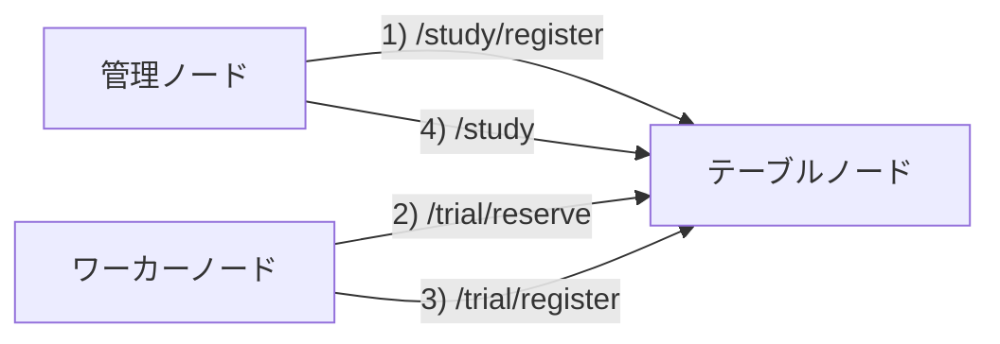

# lite_dist
簡易的な分散処理システムです

## 1. 必要要件
python >= 3.12

## 2. 依存ライブラリ
- flask
- requests
- tqdm
- pytest

## 3. 機能の概要
与えられた `Study` (タスクのこと) を分散処理で実行します。次の3種類のノードを使用します。実際の物理マシンはどれを兼任しても問題無いです。
> [!WARNING]  
> 現状の実装ではハッシュ関数の原像計算のみに対応しています。
> 
### 3-1. 管理ノード
`Study` の登録や結果の取得を行います。このノードを動かすための python スクリプトは現状では実装していないので、curl や talend などのAPIツールを使用してください。

### 3-2. テーブルノード
`Study` を細切れにした `Trial` を管理するノードです。`Trial` の提案とその結果の集約を行います。このノードの台数は常に1台にしてください。

### 3-3. ワーカーノード
テーブルノードから取得した `Trial` を実行し、結果をテーブルノードに返却します。

## ノード構成

カッコ内の数字は典型的な使い方でのAPIアクセスの順番を表しています。

## 使い方
以下のコマンドはリポジトリ直下で行います。
> [!CAUTION]  
> グローバルIPが必要な環境では使用できません。必ずLAN内で使用してください。  
> また、テーブルノードはIPをLAN内に開放しているので、必ず信頼できるネットワーク内でのみ利用してください。

### 事前準備
テーブルノード、ワーカーノードとして使うマシンにリポジトリをクローンし、依存ライブラリをインストールしてください。  
管理ノードに対してはこの操作は不要です。

### テーブルノードの起動
テーブルノードで以下のコマンドを実行してください。
```shell
python start_table_node.py
```
起動が成功すれば、プライベートIPアドレスが表示されるので、以降はこの値を使ってください。

### Study の登録
管理ノードから以下のような JSON を POST してください。
```shell
curl -X POST \
     -H "Content-Type: application/json" \
     -d '{"target":"caf9b6b99962bf5c2264824231d7a40c", "method":"md5"}' \
     http://{IP_OF_TABLE_NODE}:80/study/register
```
`{IP_OF_TABLE_NODE}` にはテーブルノードのIPアドレスを入れてください。またポート番号は config で変更できます。
成功すれば以下のような JSON が返却されるはずです。
```json
{
  "study_id": "a5ae10cf-c9cf-11ef-ac70-caf9b6b99962",
  "message": null,
  "success": true
}
```
`study_id` は最後に結果を取得するときに使用します。

### ワーカーノードの起動
ワーカーノードで以下のコマンドを実行してください。
```shell
python start_worker_node.py {IP_OF_TABLE_NODE} worker_node_1
```
同様に `{IP_OF_TABLE_NODE}` にはテーブルノードのIPアドレスを入れてください。  
`worker_node_1` はこのノードの名前です。好きな値を入れてください。テーブルノードのログ表示に使われます。  
以降はワーカーノードがテーブルノードから `Trial` を取得し、計算し、結果を POST する一連の作業が自動で行われます。

### 結果の取得
以下のコマンドで結果を取得できます。
```shell
curl http://{IP_OF_TABLE_NODE}:80/study?study_id=a5ae10cf-c9cf-11ef-ac70-caf9b6b99962
```
計算が終わっていれば次のような JSON が返却されます。
```json

```
終わっていなければ以下のようなメッセージが返却されます。
```json
{
  "message": "a5ae10cf-c9cf-11ef-ac70-caf9b6b99962 has not been resolved yet"
}
```

## テーブルノードのAPI使用

## 型定義

## Config