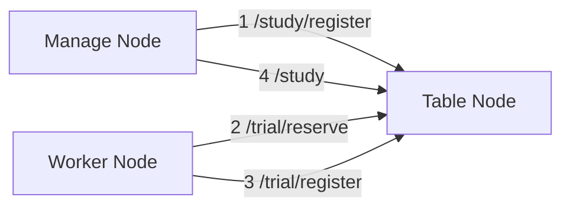

# lite_dist
Simple distributed computing system

## 1. Requirement
python >= 3.12

## 2. Dependency Libraries
- flask
- requests
- tqdm
- pytest

## 3. Overview of Functions
Executes a given `Study` (i.e. task) in a distributed computing. The following 3 types of nodes are used. The actual physical machine can serve as any of them.
> [!WARNING]  
> The current implementation only supports computing the preimage of some hash functions.

### 3-1. Manage Node
Register a `Study` and retrieve results. We do not currently implement python scripts to run this node, so please use API tools such as curl or talend.

### 3-2. Table Node
A node that manages `Trial`, which is a fragment of `Study`. It is responsible for suggesting `Trial` and aggregating the results.  
**The number of this node should always be one.**

### 3-3. Worker Node
Executes a `Trial` retrieved from a table node and returns the result to the table node.

## 4. Node Structure

The numbers represent the order of API access in typical usage.

## 5. Usage
The following commands are performed directly under the repository.
> [!CAUTION]  
> Cannot be used in environments that require a global IP. Be sure to use it within a LAN.  
> Also, a table node open their IPs to the LAN, so be sure to use them only within a trusted network.

### 5-1. Prepare
Clone the repository to the machine to be used as a table node or worker node and install the dependent libraries.  
This operation is not necessary for the manage node.

### 5-2.  Activate table node
Execute the following command on the table node.
```shell
python start_table_node.py
```
If the startup is successful, the private IP address will be displayed, and this value should be used thereafter.

### 5-3. Register study
POST the following JSON from the manage node.
```shell
curl -X POST \
     -H "Content-Type: application/json" \
     -d '{"target":"caf9b6b99962bf5c2264824231d7a40c", "method":"md5"}' \
     http://{IP_OF_TABLE_NODE}:80/study/register
```
The `{IP_OF_TABLE_NODE}` should be the IP address of the table node. The port number can be changed in config.  
If successful, the following JSON should be returned.
```json
{
  "study_id": "a5ae10cf-c9cf-11ef-ac70-caf9b6b99962",
  "message": null,
  "success": true
}
```
The `study_id` is used to retrieve the results at the end.

### 5-4. Activate worker node
Execute the following command on the worker node.
```shell
python start_worker_node.py {IP_OF_TABLE_NODE} worker_node_1
```
Similarly, `{IP_OF_TABLE_NODE}` should be the IP address of the table node.  
`worker_node_1` is the name of this node. You can put any value you like. It will be used to display the log of the table node.  
From then on, the worker node will automatically retrieve the `Trial` from the table node, calculate it, and POST the result.

### 5-5. Retrieve result
The following commands can be used to obtain results.
```shell
curl http://{IP_OF_TABLE_NODE}:80/study?study_id=a5ae10cf-c9cf-11ef-ac70-caf9b6b99962
```
If the calculation is completed, the following JSON will be returned.
```json
{
    "current_max": "69ffffff",
    "method": "md5",
    "result": "696e666f",
    "study_id": "4dd9e078-ca16-11ef-8f79-caf9b6b99962",
    "target": "caf9b6b99962bf5c2264824231d7a40c",
    "trial_table": [
        {
            "method": "md5",
            "preimage": null,
            "range": {
                "size": 1761607680,
                "start": "0"
            },
            "status": "DONE",
            "study_id": "4dd9e078-ca16-11ef-8f79-caf9b6b99962",
            "target": "caf9b6b99962bf5c2264824231d7a40c",
            "trial_id": "xa569f81a8b641ae"
        },
        {
            "method": "md5",
            "preimage": "696e666f",
            "range": {
                "size": 16777216,
                "start": "69000000"
            },
            "status": "RESOLVED",
            "study_id": "4dd9e078-ca16-11ef-8f79-caf9b6b99962",
            "target": "caf9b6b99962bf5c2264824231d7a40c",
            "trial_id": "726b62698a2436db"
        }
    ]
}

```
`result` is the result of this `Study`.
If it is not finished, the following message is returned. The status code is 202.
```json
{
  "message": "a5ae10cf-c9cf-11ef-ac70-caf9b6b99962 has not been resolved yet"
}
```

## 6. API specification for table node
| Path            | Method | Parameters                      | Body    | Response              | Description                                                                                                                                                              |
|-----------------|--------|---------------------------------|---------|-----------------------|--------------------------------------------------------------------------------------------------------------------------------------------------------------------------|
| /study          | GET    | study_id: `str`                 | None    | `Study` or `Message`  | Attempts to retrieve processing results.<br/>If the processing is not yet complete, `Message` is returned.                                                               |
| /study/register | POST   | None                            | `Study` | `StudyRegisterResult` | Use to register `Study` to the table node.                                                                                                                               |
| /trial/reserve  | GET    | max_size: `int`<br/>name: `str` | None    | `Trial`               | Use to reserve a `Trial` for the worker node.<br/>The calculation amount (`Trial.trial_range.size`) may be less than max_size depending on the status of the table node. |
| /trial/register | POST   | name: `str`                     | `Trial` | `TrialRegisterResult` | Use to register a `Trial` that the worker node has handled.                                                                                                              |
| /status         | GET    | None                            | None    | `Curriculum`          | Allows you to check the current status of the table node.                                                                                                                |

## 7. Config
The repository provides `config.json`, which controls some behaviors of the distributed processing.

| Name                       | Type | Required | Description                                                                                                                                                   |
|----------------------------|------|----------|---------------------------------------------------------------------------------------------------------------------------------------------------------------|
| common.minimum_chunk_size  | int  | true     | Minimum size of `Trial`. The actual size is the product of this value and worker.trial_size_ratio. It must be a power of 2.                                   |
| table.port                 | int  | true     | Port number used by the table node.                                                                                                                           |
| table.trial_suggest_method | str  | true     | The method to be used when suggesting `Trial`. Currently, only `“sequential”` is valid.                                                                       |
| worker.thread_num          | int  | false    | Number of threads used by worker nodes. Default value is 0, in which case the number of CPUs is used.                                                         |
| worker.trial_size_ratio    | int  | false    | A scaling factor to determine the size of the `Trial`. The default value is 0, in which case it is benchmarked before execution and determined based on that. |
| worker.sleep_sec_on_empty  | int  | false    | Number of seconds to wait when table node has no `Study`. Default value is 10 (seconds).                                                                      |


## 8. Type Definition
### 8-1. Trial
| Name        | Type         | Required | Description                                                                                                                                                                                                                           |
|-------------|--------------|----------|---------------------------------------------------------------------------------------------------------------------------------------------------------------------------------------------------------------------------------------|
| study_id    | str          | true     | The ID of the parent `Study`, generated from target and generation time.                                                                                                                                                              |
| trial_id    | str          | true     | The ID of this object, generated from study_id and trial_range.                                                                                                                                                                       |
| trial_range | `TrialRange` | true     | Range of calculation.                                                                                                                                                                                                                 |
| target      | str          | true     | Target value. Hexadecimal byte array.                                                                                                                                                                                                 |
| method      | str          | true     | A string representing the calculation method.                                                                                                                                                                                         |
| status      | str          | true     | The state of this `Trial`. Possible values are as follows.<br/>- NOT_CALCULATED: Not yet calculated<br/>- RESERVED: Reserved by one of the `Trial`<br/>- DONE: Calculated<br/>- RESOLVED: Calculated and parent's `Study` is resolved |
| preimage    | str          | false    | The original value from which target is generated.                                                                                                                                                                                    |

### 8-2. TrialRange
| Name  | Type | Required | Description                                                                                                      |
|-------|------|----------|------------------------------------------------------------------------------------------------------------------|
| start | str  | true     | The starting point of the range of calculations to be performed in that `Trial`. Hexadecimal byte array.         |
| size  | int  | true     | The size of the range of calculations to be performed in that `Trial`. Note that this is `int`, not hexadecimal. |

### 8-3. Study
| Name        | Type          | Required                   | Description                                                                                        |
|-------------|---------------|----------------------------|----------------------------------------------------------------------------------------------------|
| study_id    | str           | false<br/>(true on /study) | ID of this object, published in registration on /study/register.                                   |
| target      | str           | true                       | Target value. Hexadecimal byte array.                                                              |
| method      | str           | true                       | A string representing the calculation method.                                                      |                                           |
| trial_table | list[`Trial`] | false<br/>(true on /study) | List of suggested `Trial`. Adjacent computed `Trial`s are merged to reduce computation and memory. |                                           |
| result      | str           | false                      | The original value from which target is generated.                                                 |                                           |
| current_max | str           | false<br/>(true on /study) | The maximum value that is being calculated at that time. Hexadecimal byte array.                   |                                           |


### 8-4. Curriculum
| Name    | Type          | Required | Description                      |
|---------|---------------|----------|----------------------------------|
| studies | list[`Study`] | true     | List of `Study` to be performed. |

### 8-5. TrialRegisterResult
| Name     | Type | Required | Description                                                     |
|----------|------|----------|-----------------------------------------------------------------|
| success  | bool | true     | Flag indicating whether the registration was successful or not. |
| has_hext | bool | true     | Flag indicating whether the next `Trial` is available.          |
| message  | str  | false    | Error message when registration fails.                          |

### 8-6. StudyRegisterResult
| Name     | Type | Required | Description                                                     |
|----------|------|----------|-----------------------------------------------------------------|
| success  | bool | true     | Flag indicating whether the registration was successful or not. |
| study_id | str  | true     | ID published in registration.                                   |
| message  | str  | false    | Error message when registration fails.                          |

### 8-7. Message
| Name    | Type | Required | Description |
|---------|------|----------|-------------|
| message | str  | true     |             |
